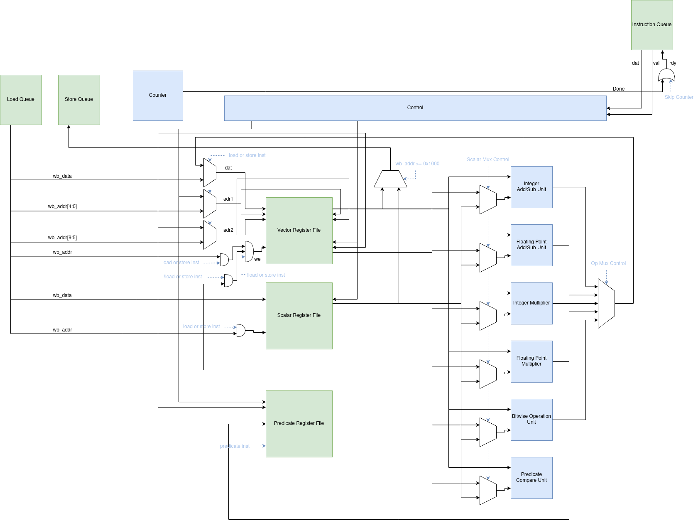

# Vector Extension to Caravel Management SoC
Written for the EFabless AI Chip competition, this project adds basic vector instructions to the Caravel Management SoC.

All code, besides file paths are written using ChatGPT. This includes test cases, C libraries, blocks, etc. 

All Prompts used to generate code are included in this repository. The prompts within a file may not be in the order we asked ChatGPT. As we would find bugs, we would go back to previous prompts and fix the implementation within those prompts. However, the files are separated by block and topic. We have found it is difficult to do complex things within a single, long prompt, as GPT4 reaches its token limit and forgets how to do things.

## Features
- [x] Integer Operations
- [x] (almost*) IEEE-754 compliant floating point adder and multiplier
- [x] Bitwise logical operations
- [x] Scalar instructions
- [x] 6 vector registers, each being 32 elements and 32 bits. Directly acessable over wishbone interface.
- [x] 6 scalar registers, each being 32 bits. Directly acessable over wishbone interface.
- [x] Predicate Instructions for vectored-conditionals
- [x] C-Library for wrapping wishbone loads/stores
- [x] Basic Machine Learning Library

# ISA and Register Mapping 

The instructions supported on the processor are included in the table below. We had GPT4 generate an initial draft of the instructions, then we changed them as needed for our implementaton to make sense. Any of these instrucitons can be run by sending the instruciton over the wishbone address 0x30000000. The only exception to these instructions are the load/store instrucitons. Where instead writing to a vector or scalar register via sending a load/store instruciton over 0x30000000, you can just write or read from memory addresses: 
0x30000004 -> 0x30000380 for vector registers
0x30001000 -> 0x30001018 for scalar registers

Additionally, for predicate register instrucitons you do not need to actually set Ssrc to anything meaningful, as each element in the destination predicate register will have values written to it for anything valuable. It is reccomended you use the C library ```vplib``` to interact with the processor, as this abstracts away the low-level register reads and writes you would need to do.

## ISA

| Instruction	| Opcode	| Operand 1	    | Operand 2	   | Operand 3	| Description |
| ------------- | --------- | ------------- | ------------ | ---------- | ----------- |                                                                                     
| VLOAD	        | 0x00	    | Vdest	        | Saddr	       | Slen	    | Load a vector from memory into Vdest. The base address is in Saddr, and the length is in Slen.|
| VSTORE	    | 0x01	    | Vsrc	        | Saddr	       | Slen	    | Store a vector from Vsrc to memory. The base address is in Saddr, and the length is in Slen.|
| VADD	        | 0x02	    | Vdest	        | Vsrc1	       | Vsrc2	    | Add two vectors element-wise. Vsrc1 + Vsrc2 -> Vdest.|
| VSUB	        | 0x03	    | Vdest	        | Vsrc1	       | Vsrc2	    | Subtract two vectors element-wise. Vsrc1 - Vsrc2 -> Vdest.|
| VMUL	        | 0x04	    | Vdest	        | Vsrc1	       | Vsrc2	    | Multiply two vectors element-wise. Vsrc1 * Vsrc2 -> Vdest.|
| VSMUL	        | 0x05	    | Vdest	        | Vsrc	       | Ssrc	    | Multiply a vector by a scalar. Vsrc * Ssrc -> Vdest.|
| VSADD	        | 0x06	    | Vdest	        | Vsrc	       | Ssrc	    | Add a scalar to a vector. Vsrc + Ssrc -> Vdest.|
| VFADD	        | 0x07	    | Vdest	        | Vsrc1	       | Vsrc2	    | Add two floating-point vectors element-wise. Vsrc1 + Vsrc2 -> Vdest.|
| VFMUL	        | 0x08	    | Vdest	        | Vsrc1	       | Vsrc2	    | Multiply two floating-point vectors element-wise. Vsrc1 * Vsrc2 -> Vdest.|
| VFSMUL	    | 0x15	    | Vdest	        | Vsrc	       | Ssrc	    | Multiply a floating-point vector by a scalar. Vsrc * Ssrc -> Vdest.|
| VFSADD	    | 0x16	    | Vdest	        | Vsrc	       | Ssrc	    | Add a scalar to a floating-point vector. Vsrc + Ssrc -> Vdest.|
| VAND	        | 0x09	    | Vdest	        | Vsrc1	       | Vsrc2	    | Perform bitwise AND operation on two integer vectors. Vsrc1 AND Vsrc2 -> Vdest.|
| VOR	        | 0x0A	    | Vdest	        | Vsrc1	       | Vsrc2	    | Perform bitwise OR operation on two integer vectors. Vsrc1 OR Vsrc2 -> Vdest.|
| VXOR	        | 0x0B	    | Vdest	        | Vsrc1	       | Vsrc2	    | Perform bitwise XOR operation on two integer vectors. Vsrc1 XOR Vsrc2 -> Vdest.|
| VPSETZ	    | 0x0C	    | Pdest	        | Ssrc	       | -	        | Set predicate register Pdest to 1 for each element in Ssrc that is zero, and 0 otherwise.|
| VPSETN	    | 0x0D	    | Pdest	        | Ssrc	       | -	        | Set predicate register Pdest to 1 for each element in Ssrc that is non-zero, and 0 otherwise.|
| VPSET	        | 0x0E	    | Pdest	        | Ssrc	       | -	        | Set predicate register Pdest to 1 for each element in Ssrc.|
| VPSGE	        | 0x0F	    | Pdest	        | Ssrc1	       | Ssrc2	    | Set predicate register Pdest to 1 for each element in Ssrc1 that is signed greater than or equal to the corresponding element in Ssrc2, and 0 otherwise. |
| VPSLT	        | 0x18	    | Pdest	        | Ssrc1	       | Ssrc2	    | Set predicate register Pdest to 1 for each element in Ssrc1 that is signed less than the corresponding element in Ssrc2, and 0 otherwise.|
| VPUGE	        | 0x19	    | Pdest	        | Ssrc1	       | Ssrc2	    | Set predicate register Pdest to 1 for each element in Ssrc1 that is unsigned greater than or equal to the corresponding element in Ssrc2, and 0 otherwise.|
| VPULT	        | 0x1A	    | Pdest	        | Ssrc1	       | Ssrc2	    | Set predicate register Pdest to 1 for each element in Ssrc1 that is unsigned less than the corresponding element in Ssrc2, and 0 otherwise.|
| VFSUB	        | 0x10	    | Vdest	        | Vsrc1	       | Vsrc2	    | Subtract two floating-point vectors element-wise. Vsrc1 - Vsrc2 -> Vdest.|
| VPEQ	        | 0x14	    | Pdest	        | Psrc1	       | Psrc2	    | Set predicate register Pdest to 1 if Psrc1 is equal to Psrc2, and 0 otherwise.|
| VPNEQ	        | 0x17	    | Pdest	        | Psrc1	       | Psrc2	    | Set predicate register Pdest to 1 if Psrc1 is not equal to Psrc2, and 0 otherwise.|


## Register Mapping

# C++ Library

# Microarchitecture

# Testing Strategy

# Phyiscal Design 

# Performance

# Learnings
